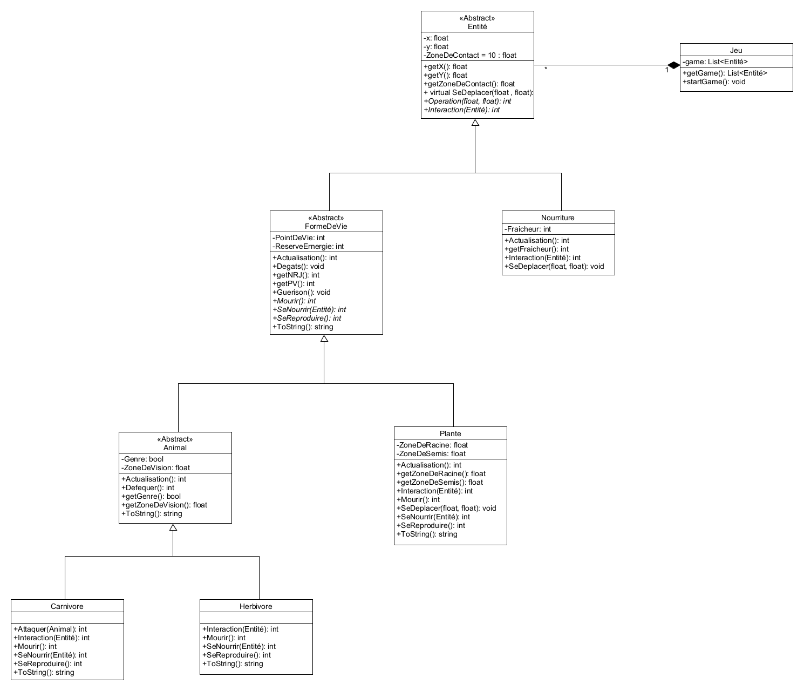
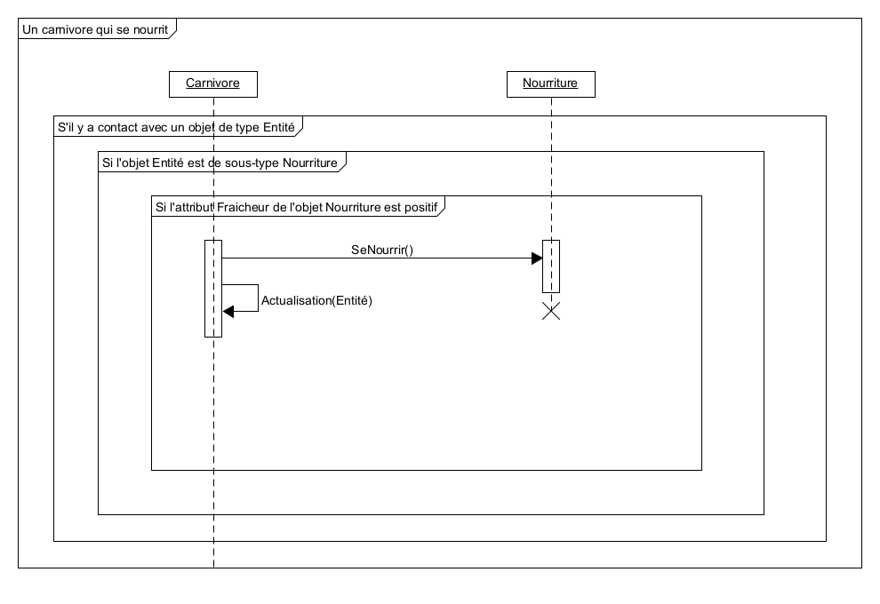

# Rapport du projet OOP 2021

## Introduction

Le projet de programmation orientée objet de cette année consiste en la réalisation d'un simulateur d'**écosystème** simplifié. Dans cet écosystème, il y a des objets **FormeDeVie** qui vivent, se nourrissent, se reproduisent, etc

## Gestion des points de vie et d'énergie

Pour la gestion des points de vie et d'énergie, j'ai créé des attributs **PointDeVie** et **ReserveEnergie** pour la classe **FormeDeVie**.

## Gestion des zones

Pour la gestion des différentes zones, j'ai créé des attributs **ZoneDeContact** pour les contacts, **ZoneDeVision** pour la vision des Animaux, **ZoneDeRacine** pour les plantes dans laquelle elles peuvent consommer les déchets organiques et **ZoneDeSemis** aussi pour les plantes et qui est la zone dans laquelle de nouvelles plantes peuvent apparaître autour d'une plante existante.

## Gestion de l'alimentation

Pour l'alimentation, j'ai créé une classe **Nourriture** qui possède un attribut **Fraicheur** qui est positif ou négatif et qui permet de savoir s'il s'agit de **Viande** (nourriture pour les **Carnivore**) ou de **Déchets organiques** (nourriture pour les **Plante**), l'attribut **Fraicheur** se décrémente de 1 au fur et a mesure que le programme "avance" pour simuler la transformation de la **Viande** en **Déchets organique** (pourriture).
De plus, les **Herbivores** se nourrissent de **Plantes**, touts cette alimentation est faite grâce à la méthode **SeNourrir()**.

## Gestion de la reproduction

Pour la reproduction, les **Aminaux** se reproduisent grâce à la méthodes **SeReproduire()** lorsqu'il a contact entre deux **Animaux** de genre opposé, les **Plantes** elles font apparaitre d'autre **Plantes** autour d'elles (dans la **ZoneDeSemis**). Les **Carnivore** se reproduise uniquement avec des **Carnivores** et les **Herbivores** uniquement avec des **Herbivores**.

## Diagramme UML
### Diagramme de classe

### Diagramme de séquence

## Principes SOLID

- Le premier principe que j'ai utilisé dans le projet est le **prince de responsabilité unique**, en effet, toutes les classes ont leurs attributs en privé et ces attributs sont dépendants de la classes, c'est elle qui les modifie.

- Le seconde prince que j'ai utilisé dans mon code est le **principe ouvert/fermé**, en effet, toutes les classes sont ouvert à l'extension et fermée à la modification grâce à l'utilisation de **getter**. 

## Conclusion

Pour conclure, ce projet m'aura été très utile pour renforcer mes connaissances et ma compréhension du concept de programmation orientée objet et du langage de programmation **C#**.
